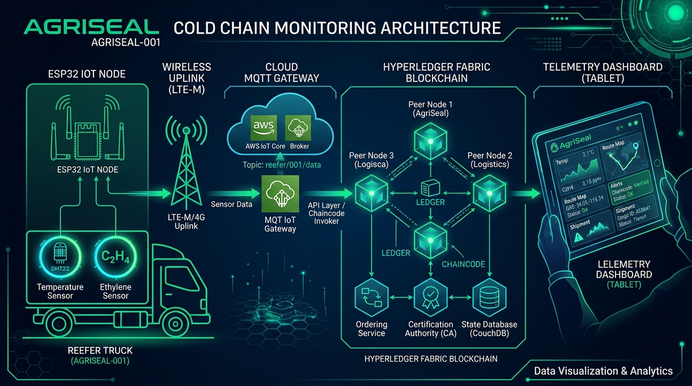

<p align="center">
  
</p>

<h1 align="center">🌾 AgriSeal — Low-Cost IoT Blockchain Nodes for Farm-to-Fork Traceability</h1>

<p align="center">
  <b>Smart India Hackathon 2026 | PS ID: 26232 | Team Arishem (ID: 158445)</b><br/>
  <i>Theme: Agriculture, FoodTech & Rural Development | Category: Hardware</i>
</p>

<p align="center">
  
  
  
  
  
</p>

---

## 📋 Table of Contents

- [Problem Statement](#-problem-statement)
- [Our Solution](#-our-solution)
- [System Architecture](#-system-architecture)
- [Hardware Specifications](#-hardware-specifications)
- [Tech Stack](#-tech-stack)
- [Repository Structure](#-repository-structure)
- [Getting Started](#-getting-started)
- [Detailed Report](#-detailed-report)
- [Demo & Screenshots](#-demo--screenshots)
- [Team](#-team)
- [License](#-license)

---

## 🎯 Problem Statement

> **Low-Cost IoT Blockchain Nodes for Farm-to-Fork Traceability**

India's agricultural cold-chain faces critical challenges:

- **8,831 cold storages** with 402.87 lakh MT capacity, yet widespread monitoring gaps
- **SMEs excluded** from expensive enterprise monitoring solutions
- **Network dropouts** in rural/remote areas create blind spots in shipment history
- **Tamper-prone** conventional data loggers with no integrity verification
- **No unified traceability** from farm → processing → storage → market

---

## 💡 Our Solution

**AgriSeal** is a low-cost, rugged IoT node that provides **tamper-evident, offline-capable** cold-chain monitoring with **blockchain-backed traceability**.

| Feature | How It Works |
|---|---|
| 🌡️ **SENSE** | Temperature, Humidity & Ethylene monitoring |
| 📍 **TRACK** | GPS/GNSS Real-time Location, Speed & Route tracking |
| 💰 **LOW-COST NODE** | ₹2,100/unit — Plug-and-play, Reusable |
| 📴 **OFFLINE MODE** | Sense & Store locally when no network |
| 🔄 **AUTO-SYNC** | Reconnect & Securely sync stored data |
| 🔒 **TAMPER-EVIDENT** | AES Encryption + SHA-256 Hash Chain |
| 🏗️ **RUGGED** | IP67 — Moisture, Dust & Vibration proof |
| ☀️ **SOLAR-ASSISTED** | Low power + Solar charging = 52+ hr battery |
| ⛓️ **BLOCKCHAIN** | Hyperledger Fabric permissioned ledger via MQTT |

---

## 🏗️ System Architecture



```
┌─────────────────┐     MQTT/4G      ┌──────────────────┐     Fabric SDK     ┌─────────────────────┐
│   AgriSeal      │ ──────────────►  │   Cloud Backend   │ ───────────────►  │  Hyperledger Fabric  │
│   IoT Node      │                  │   (Node.js +      │                   │  (Permissioned       │
│                 │                  │    PostgreSQL)     │                   │   Blockchain)        │
│  ESP32 + Sensors│  ◄── Auto-Sync   │                   │                   │                      │
│  + GPS / GNSS   │     on Reconnect │   MQTT Broker     │                   │  Chaincode (Go)      │
│  + Hash Chain   │                  │   (Mosquitto)     │                   │  Hash Digests        │
│  + Flash/FRAM   │                  │                   │                   │  Compliance Certs    │
│  + AES Crypto   │                  │   REST API        │                   │  Geo Provenance      │
│  + Solar Power  │                  │                   │                   │                      │
└─────────────────┘                  └────────┬──────────┘                   └──────────────────────┘
                                              │
                                              │ WebSocket
                                              ▼
                                     ┌──────────────────┐
                                     │  React Dashboard  │
                                     │  - Live Sensors   │
                                     │  - GPS Map / Route│
                                     │  - Ledger Explorer│
                                     │  - Alert Panel    │
                                     └──────────────────┘
```

---

## 🔧 Hardware Specifications

| Component | Specification | Cost (₹) |
|---|---|---|
| ESP32-WROOM-32 | Dual-core 240MHz, WiFi+BLE | 250–350 |
| DHT22 | Temp: -40~80°C, Humidity: 0–100% RH | 150–200 |
| MQ135 / MiCS-5524 | Ethylene (C₂H₄) gas detection | 200–400 |
| NEO-6M / ATGM336H | Multi-constellation GPS/GNSS receiver | 200–250 |
| SIM7600E / BC66 | 4G / NB-IoT cellular module | 500–800 |
| W25Q128 / FM24C256 | 16MB Flash / 32KB FRAM | 50–100 |
| ATECC608A | Secure element (hardware crypto) | 100–150 |
| 6V 1W Solar Panel | Solar energy harvesting | 150–200 |
| TP4056 + 18650 | Li-Ion charging + 3.7V battery | 150–200 |
| IP67 Enclosure | Waterproof, dustproof casing | 200–300 |
| **Total/Node** | | **₹1,950–2,950** |

---

## 🛠️ Tech Stack

| Layer | Technology |
|---|---|
| **Microcontroller** | ESP32 / STM32 |
| **Sensors** | DHT22 (Temp/Humidity), MQ135 (Ethylene) |
| **Location** | GPS / GNSS (u-blox NEO-6M / ATGM336H) |
| **Connectivity** | 4G / NB-IoT via MQTT / MQTT-SN |
| **Local Storage** | Flash (W25Q128) / FRAM (FM24C256) |
| **Security** | AES-128 Encryption, SHA-256 Hash Chain, ATECC608A |
| **Blockchain** | Hyperledger Fabric (Permissioned) |
| **Backend** | Node.js + Express, PostgreSQL |
| **Frontend** | React.js + Vite |
| **DevOps** | Docker, PlatformIO |
| **Power** | Solar Panel + Li-Ion Battery |

---

## 📁 Repository Structure

```
AgriSeal-SIH2026/
├── README.md                    # This file
├── LICENSE                      # MIT License
├── docs/
│   └── REPORT.md                # ⭐ Detailed project report
├── hardware/
│   ├── bom/BOM.md               # Bill of Materials
│   ├── datasheets/DATASHEETS.md # Component datasheets
│   └── enclosure/               # Enclosure design docs
├── firmware/
│   └── esp32_node/              # ESP32 firmware (PlatformIO)
├── blockchain/
│   ├── chaincode/               # Hyperledger Fabric smart contract
│   └── network/                 # Fabric network configuration
├── backend/
│   └── src/                     # Node.js REST API + MQTT
├── frontend/
│   └── src/                     # React.js dashboard
└── assets/                      # Diagrams, photos, screenshots
```

---

## 🚀 Getting Started

### Prerequisites

- [PlatformIO](https://platformio.org/) — Firmware development
- [Node.js](https://nodejs.org/) v18+ — Backend & Frontend
- [Docker](https://www.docker.com/) — Hyperledger Fabric network
- [PostgreSQL](https://www.postgresql.org/) — Database

### 1. Flash Firmware

```bash
cd firmware/esp32_node
# Edit include/config.h with your WiFi/MQTT settings
pio run --target upload
```

### 2. Start Blockchain Network

```bash
cd blockchain/network
docker-compose up -d
```

### 3. Start Backend

```bash
cd backend
npm install
cp .env.example .env
# Edit .env with your database and MQTT broker settings
npm start
```

### 4. Start Frontend

```bash
cd frontend
npm install
npm run dev
```

---

## 📄 Detailed Report

The full project report with literature review, architecture details, testing results, and future scope is available at:

👉 **[docs/REPORT.md](docs/REPORT.md)**

---

## 🖥️ Demo & Screenshots

| Dashboard | Shipment Tracker | Blockchain Ledger |
|---|---|---|
|  |  |  |

---

## 👥 Team Arishem

| Role | Member |
|---|---|
| Team ID | 158445 |
| Team Name | Arishem |

---

## 📜 License

This project is licensed under the MIT License — see the [LICENSE](LICENSE) file for details.

---

<p align="center">
  <b>Made with ❤️ for Smart India Hackathon 2026</b><br/>
  <i>Building affordable food safety infrastructure for India</i>
</p>
