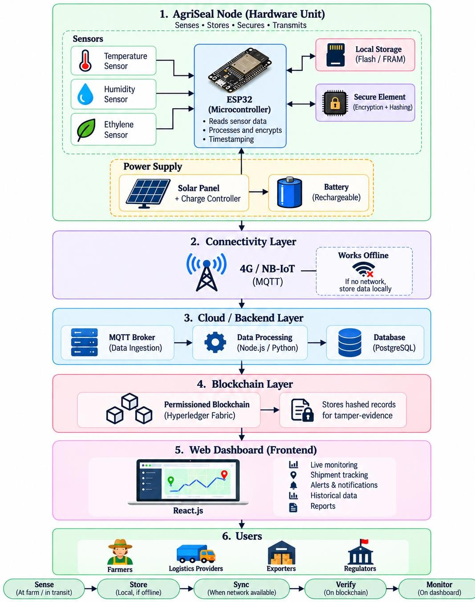
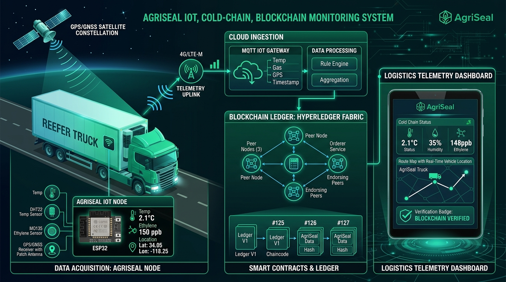
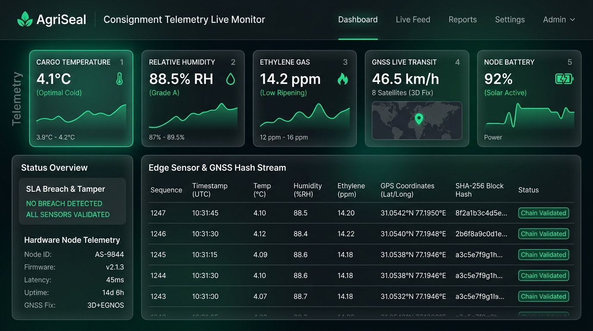
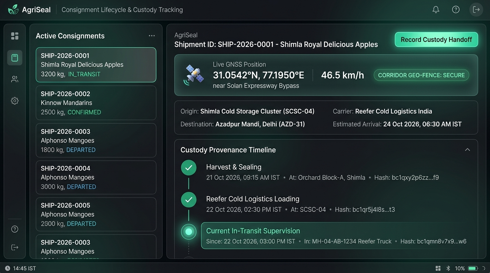
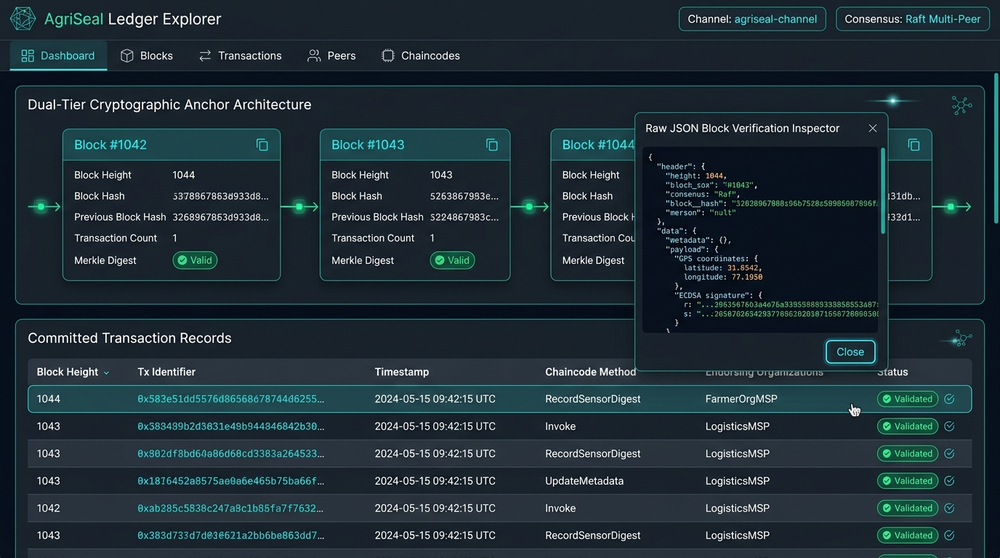
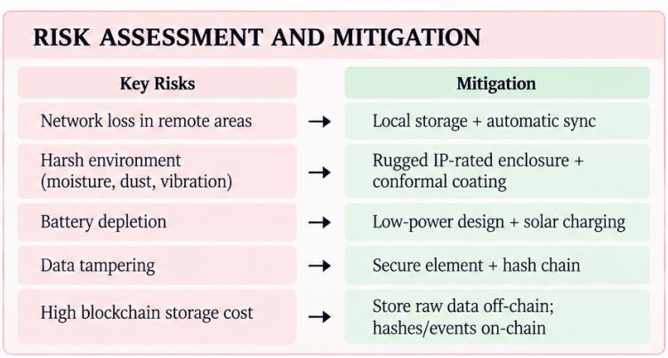

<p align="center">
  
  &nbsp;&nbsp;&nbsp;&nbsp;&nbsp;&nbsp;&nbsp;&nbsp;&nbsp;&nbsp;&nbsp;&nbsp;
  
</p>

<h1 align="center">📋 AgriSeal — Detailed Project Report</h1>

<p align="center">
  <b>Smart India Hackathon 2026 | Problem Statement ID: 26232</b><br/>
  <b>Team Arishem (ID: 158445)</b><br/>
  <i>Low-Cost IoT Blockchain Nodes for Farm-to-Fork Traceability</i>
</p>

---

## Table of Contents

1. [Problem Statement](#1-problem-statement)
2. [Literature Review](#2-literature-review)
3. [Hardware Architecture & Bill of Materials](#3-hardware-architecture--bill-of-materials)
4. [System Architecture](#4-system-architecture)
5. [Sensor Data Processing & Feature Engineering](#5-sensor-data-processing--feature-engineering)
6. [Manufacturing & Assembly Pipeline](#6-manufacturing--assembly-pipeline)
7. [Testing & Validation Results](#7-testing--validation-results)
8. [Dashboard & Prototype Visuals](#8-dashboard--prototype-visuals)
9. [Future Scope](#9-future-scope)
10. [References](#10-references)

---

## 1. Problem Statement

### 1.1 Official Problem Statement

| Field | Detail |
|---|---|
| **Problem Statement ID** | 26232 |
| **Title** | Low-Cost IoT Blockchain Nodes for Farm-to-Fork Traceability |
| **Theme** | Agriculture, FoodTech & Rural Development |
| **Category** | Hardware |
| **Team Name** | Arishem |
| **Team ID** | 158445 |

### 1.2 Problem Description

India's agricultural supply chain handles over **400 million metric tonnes** of food annually, yet an estimated **40% of perishable produce** is lost before reaching consumers — largely due to cold-chain failures, lack of monitoring, and absence of traceable records.

The **core challenges** driving this problem:

1. **Continuous Monitoring Gap** — Food shipments traversing farm → mandi → processing → storage → market require uninterrupted temperature, humidity, and gas monitoring. Most SMEs cannot afford enterprise-grade monitoring systems.

2. **Traceability Deficit** — Strict traceability is mandated for food safety, export compliance (APEDA/FSSAI), and fraud prevention, yet most supply chain participants rely on manual paper-based records that are easily falsified.

3. **SME Exclusion** — High-cost monitoring systems (₹15,000–50,000/unit) leave the majority of Small and Medium Enterprises without reliable cold-chain visibility. India has **8,831 cold storages** with a combined capacity of **402.87 lakh MT**, but monitoring penetration remains low.

4. **Network Connectivity Issues** — Remote and rural areas experience frequent network dropouts, creating blind spots in shipment history where critical environmental excursions go unrecorded.

5. **Environmental Durability** — Conventional data loggers are vulnerable to moisture, dust, and vibration — common conditions in agricultural transport.

6. **Data Integrity Concerns** — Temperature, humidity, and ethylene records can be tampered with, manipulated, or selectively deleted — compromising trust in cold-chain data and making regulatory audits unreliable.

7. **Battery Limitations** — Limited battery life in existing loggers makes long-duration, unattended monitoring difficult, especially for cross-country shipments lasting 12–48 hours.

8. **Infrastructure Expansion** — The government has sanctioned **408 integrated cold-chain projects under PMKSY** (Pradhan Mantri Kisan Sampada Yojana), creating an urgent need for affordable monitoring solutions that can scale with this growth.

### 1.3 Why This Matters

- **₹92,000 crore** — Estimated annual value of food waste in India due to cold-chain failures
- **30–40%** — Post-harvest losses for fruits and vegetables
- **16%** — Cold-chain capacity utilization gap in Tier 2/3 cities
- India is the **2nd largest** fruit and vegetable producer globally, yet exports only **1–2%** due to traceability gaps

---

## 2. Literature Review

### 2.1 Feng et al. (2020) — Applying Blockchain Technology to Improve Agri-Food Traceability

**Source:** Journal of Cleaner Production, Elsevier ([Link](https://www.sciencedirect.com/science/article/pii/S0959652620310787))

**Key Findings:**
- Traditional food traceability systems suffer from **centralized data management** vulnerabilities — single points of failure and data manipulation risks.
- Blockchain provides an **immutable, distributed ledger** that ensures data integrity across all supply chain participants.
- The study proposes a **three-layer architecture**: data acquisition layer (IoT sensors), data management layer (blockchain), and application layer (user interfaces).
- **Smart contracts** can automate compliance verification — e.g., automatically flagging shipments that breached temperature thresholds.
- **Challenges identified:** High transaction costs on public blockchains, scalability issues with large volumes of sensor data, and interoperability between different supply chain systems.

**Relevance to AgriSeal:**
- Validates the blockchain approach for food traceability
- Confirms the need for **off-chain raw data storage** with on-chain hash references (which AgriSeal implements)
- Supports the choice of a **permissioned blockchain** (Hyperledger Fabric) over public chains to address cost and scalability concerns

### 2.2 Kaur et al. (2022) — Adaptation of IoT with Blockchain in Food Supply Chain Management

**Source:** MDPI Sensors, 22(21), 8174 ([Link](https://www.mdpi.com/1424-8220/22/21/8174))

**Key Findings:**
- IoT-blockchain integration in food supply chains is gaining momentum, with **edge computing** as a critical enabler for real-time processing.
- Sensor data pipelines should follow an **edge-to-cloud-to-chain** workflow: sensors → local processing → cloud aggregation → blockchain commitment.
- The study identifies **MQTT** as the optimal protocol for IoT-to-cloud communication due to its lightweight nature and publish-subscribe model.
- **Security concerns:** Raw sensor data transmission is vulnerable to man-in-the-middle attacks; end-to-end encryption is essential.
- **Key gap:** Most existing solutions assume continuous connectivity — there is limited research on **offline-first** IoT-blockchain architectures.

**Relevance to AgriSeal:**
- Validates the MQTT communication protocol choice
- Highlights the research gap that AgriSeal directly addresses — **offline-first operation with auto-sync**
- Supports edge-level encryption before data transmission

### 2.3 GS1 Fresh Fruit & Vegetable Traceability Guideline

**Source:** GS1 Global Standards ([Link](https://www.gs1.org/standards/fresh-fruit-and-vegetable-traceability-guideline/current-standard))

**Key Findings:**
- GS1 defines standardized identification systems: **GTIN** (Global Trade Item Number), **SSCC** (Serial Shipping Container Code), and **GLN** (Global Location Number).
- **EPCIS** (Electronic Product Code Information Services) provides a framework for event-based traceability — capturing WHAT, WHERE, WHEN, and WHY for each supply chain event.
- The guideline mandates **Critical Tracking Events (CTEs)** at each handover point: harvesting, packing, shipping, receiving, and storing.
- **Data sharing** across supply chain partners is essential but challenging due to lack of standardized data exchange formats.

**Relevance to AgriSeal:**
- AgriSeal's blockchain events align with GS1's CTE framework
- Future integration with GS1 identifiers for global interoperability
- EPCIS-compatible event logging in the chaincode design

### 2.4 ESP32 Technical Capabilities & NIST IoT Security Baseline

**ESP32 Datasheet** ([Espressif](https://documentation.espressif.com/esp32_datasheet_en.html)):
- Dual-core Xtensa LX6, 240MHz, 520KB SRAM
- Integrated WiFi (802.11 b/g/n) + Bluetooth 4.2/BLE
- 34 programmable GPIOs, 12-bit ADC, SPI, I²C, UART
- Ultra-low power co-processor for deep sleep operations (10μA)
- Hardware AES, SHA-2, RSA acceleration
- Operating temperature: -40°C to +125°C

**NIST IoT Cybersecurity Baseline** ([NIST](https://www.nist.gov/publications/iot-device-cybersecurity-capability-core-baseline)):
- **Device Identity:** Each device must have a unique, verifiable identity
- **Device Configuration:** Secure default configurations with ability to update
- **Data Protection:** Encryption at rest and in transit
- **Logical Access:** Role-based access control for device management
- **Software Update:** Secure OTA (Over-The-Air) update capability

**Relevance to AgriSeal:**
- ESP32's hardware crypto acceleration enables AES encryption without significant power overhead
- NIST compliance achieved through ATECC608A secure element + ESP32 hardware crypto
- Deep sleep capabilities enable the 52+ hour battery life target

### 2.5 Current Indian Cold-Chain Systems & Their Limitations

| System | Description | Limitations |
|---|---|---|
| **APEDA TraceNet** | Government traceability platform for agricultural exports | Manual data entry, no real-time monitoring, limited to export commodities |
| **FSSAI FOSCOS** | Food safety compliance system | Registration-focused, no cold-chain monitoring capability |
| **Enterprise SCADA/IoT** | Industrial monitoring (Emerson, Honeywell) | ₹15,000–50,000/node, proprietary protocols, cloud-dependent |
| **Manual Loggers** | Paper-based temperature recording | Easily falsified, no real-time alerts, no blockchain integrity |
| **USB Data Loggers** | Digital temperature loggers (single-use) | No connectivity, manual download required, no tamper evidence |

**Gap Analysis:**
- No existing solution combines **low cost + offline capability + blockchain integrity + rugged design**
- The ₹2,100 price point of AgriSeal is **7–24x cheaper** than enterprise alternatives
- Offline-first operation is unique — no current system handles network dropouts gracefully

---

## 3. Hardware Architecture & Bill of Materials

### 3.1 Node Hardware Architecture

<p align="center">
  
</p>

```
┌─────────────────────────────────────────────────────────────────┐
│                    AgriSeal IoT Node v1.0                       │
│  ┌─────────────┐    ┌──────────────┐    ┌───────────────────┐   │
│  │  SENSORS &  │    │  ESP32-WROOM │    │  COMMUNICATION    │   │
│  │  LOCATION   │    │              │    │                   │   │
│  │ DHT22 ──────┼───►│  GPIO/ADC    │    │  SIM7600E (4G)    │   │
│  │ (Temp/Hum)  │    │              │◄──►│  via UART2        │   │
│  │             │    │  SPI Bus ────┼───►│                   │   │
│  │ MQ135 ──────┼───►│  (Flash)     │    │  WiFi / BLE       │   │
│  │ (Ethylene)  │    │              │    │                   │   │
│  │             │    │  UART1 ──────┼───►│  NEO-6M GNSS      │   │
│  │ GPS/GNSS ───┼───►│  (NMEA RX/TX)│    │  (GPS/GLONASS)    │   │
│  │ (Active)    │    │              │    └───────────────────┘   │
│  └─────────────┘    │  I²C Bus ────┼───►│  ATECC608A        │   │
│                     │  (Crypto)    │    │  (Secure Element) │   │
│  ┌─────────────┐    │              │    └───────────────────┘   │
│  │  POWER       │    │  Hardware    │                            │
│  │             │    │  AES/SHA    │    ┌───────────────────┐   │
│  │ Solar Panel ─┼───►│  Engine      │    │  LOCAL STORAGE     │   │
│  │ (6V 1W)     │    │              │    │                   │   │
│  │             │    │  Deep Sleep  │    │  W25Q128 Flash    │   │
│  │ TP4056 ─────┤    │  Co-proc     │    │  (16MB SPI)       │   │
│  │ (Charger)   │    └──────────────┘    │                   │   │
│  │             │                        │  FM24C256 FRAM    │   │
│  │ 18650 Li-Ion┼───►┌──────────────┐    │  (32KB I²C)       │   │
│  │ (3.7V)      │    │  3.3V LDO    │───►└───────────────────┘   │
│  └─────────────┘    │  (AMS1117)   │                            │
│                     └──────────────┘                            │
│  ┌──────────────────────────────────────────────────────────┐   │
│  │  IP67 ENCLOSURE — Polycarbonate + Silicone Gasket         │   │
│  │  Active GPS Ceramic Patch Antenna Skyward-Mounted         │   │
│  │  Conformal Coating on PCB (Humiseal 1B73)                 │   │
│  └──────────────────────────────────────────────────────────┘   │
└─────────────────────────────────────────────────────────────────┘
```

### 3.2 Bill of Materials (BOM)

| # | Component | Part Number / Model | Specification | Qty | Unit Cost (₹) | Total (₹) |
|---|---|---|---|---|---|---|
| 1 | Microcontroller | ESP32-WROOM-32D | Dual-core 240MHz, 4MB Flash, WiFi+BLE | 1 | 280 | 280 |
| 2 | Temperature & Humidity Sensor | DHT22 / AM2302 | Temp: -40~80°C (±0.5°C), Humidity: 0–100% RH (±2%) | 1 | 180 | 180 |
| 3 | Ethylene Gas Sensor | MQ135 / MiCS-5524 | C₂H₄ detection, analog output, 10–1000 ppm | 1 | 300 | 300 |
| 4 | Cellular Module | SIM7600E-H | 4G LTE Cat-4, UART interface | 1 | 650 | 650 |
| 5 | GPS/GNSS Module | NEO-6M / ATGM336H | Multi-constellation GNSS, 2.5m CEP, UART1 | 1 | 220 | 220 |
| 6 | SPI Flash Memory | W25Q128JVSIQ | 128Mbit (16MB) SPI NOR Flash | 1 | 60 | 60 |
| 7 | FRAM Memory | FM24C256-G | 256Kbit (32KB) I²C FRAM, 10¹⁴ R/W cycles | 1 | 80 | 80 |
| 8 | Secure Element | ATECC608A-MAHDA | Hardware crypto, I²C, ECDSA P-256 | 1 | 120 | 120 |
| 9 | Solar Panel | 6V 1W Mini Panel | 110×60mm, polycrystalline | 1 | 160 | 160 |
| 10 | Battery Charger IC | TP4056 Module | Li-Ion charger with protection, USB-C input | 1 | 30 | 30 |
| 11 | Battery | NCR18650B | 3.7V 3400mAh Li-Ion cell | 1 | 120 | 120 |
| 12 | Voltage Regulator | AMS1117-3.3 | 3.3V LDO, 1A output | 1 | 10 | 10 |
| 13 | PCB | Custom 2-Layer | FR-4, 1.6mm, HASL finish, 60×40mm | 1 | 50 | 50 |
| 14 | Enclosure | IP67 Box | Polycarbonate, 100×68×50mm, cable gland | 1 | 250 | 250 |
| 15 | Conformal Coating | Humiseal 1B73 | Acrylic conformal coating (per board) | 1 | 20 | 20 |
| 16 | Passive Components | Resistors, Capacitors, LEDs | Assorted SMD 0805 | Lot | 30 | 30 |
| 17 | Connectors & Wiring | JST-XH, Antennas | Headers, active GPS patch, LTE antenna | Lot | 50 | 50 |
| | | | | | **Total** | **₹2,580** |
| | | | | | **At Scale (100+ units)** | **~₹1,800** |

### 3.3 Pin Mapping

| ESP32 GPIO | Connected To | Interface | Purpose |
|---|---|---|---|
| GPIO 4 | DHT22 Data | 1-Wire | Temperature & Humidity |
| GPIO 34 (ADC1_CH6) | MQ135 Analog Out | ADC | Ethylene level |
| GPIO 16 (TX2) | SIM7600E RXD | UART2 | Cellular TX |
| GPIO 17 (RX2) | SIM7600E TXD | UART2 | Cellular RX |
| GPIO 32 (RX1) | NEO-6M GNSS TX | UART1 | GPS/GNSS NMEA RX |
| GPIO 33 (TX1) | NEO-6M GNSS RX | UART1 | GPS/GNSS Config TX |
| GPIO 18 (SCK) | W25Q128 CLK | SPI | Flash clock |
| GPIO 19 (MISO) | W25Q128 DO | SPI | Flash data out |
| GPIO 23 (MOSI) | W25Q128 DI | SPI | Flash data in |
| GPIO 5 (SS) | W25Q128 CS | SPI | Flash chip select |
| GPIO 21 (SDA) | ATECC608A + FM24C256 | I²C | Shared I²C bus |
| GPIO 22 (SCL) | ATECC608A + FM24C256 | I²C | Shared I²C bus |
| GPIO 35 (ADC1_CH7) | Battery Voltage Divider | ADC | Battery SOC |
| GPIO 2 | Status LED | Digital | System status |
| GPIO 15 | Tamper Switch | Digital (INT) | Enclosure open detect |

### 3.4 Power Budget

| Mode | Current Draw | Duration (per cycle) | Energy (mAh) |
|---|---|---|---|
| Deep Sleep | 10 μA | 55 sec | 0.00015 |
| Sensor Read | 45 mA | 2 sec | 0.025 |
| Data Processing + Crypto | 80 mA | 1 sec | 0.022 |
| MQTT Publish (4G) | 250 mA | 2 sec | 0.139 |
| **Average per 60s cycle** | | | **0.186 mAh** |
| **Daily consumption** | | 1440 cycles | **268 mAh** |
| **Battery capacity** | | 18650 (3400mAh) | |
| **Runtime (no solar)** | | | **~52 hours** |
| **With solar (4 hrs sun)** | | +200 mAh/day | **Indefinite** |

---

## 4. System Architecture

### 4.1 High-Level Architecture



```
┌───────────────────────────────────────────────────────────────────────────────┐
│                           AgriSeal System Architecture                         │
│                                                                               │
│  ┌─────────┐   ┌─────────┐   ┌─────────┐                                     │
│  │ Node 1  │   │ Node 2  │   │ Node N  │    ← IoT Nodes (in crates/trucks)   │
│  │ ESP32   │   │ ESP32   │   │ ESP32   │                                     │
│  └────┬────┘   └────┬────┘   └────┬────┘                                     │
│       │              │              │                                          │
│       │    MQTT over 4G / NB-IoT    │                                          │
│       │    (AES-128 Encrypted)      │                                          │
│       ▼              ▼              ▼                                          │
│  ┌──────────────────────────────────────┐                                     │
│  │         MQTT Broker (Mosquitto)       │  ← Message Queue                   │
│  │    Topic: agriseal/{device_id}/data   │                                     │
│  └───────────────────┬──────────────────┘                                     │
│                      │                                                         │
│                      ▼                                                         │
│  ┌──────────────────────────────────────┐    ┌────────────────────────────┐   │
│  │       Backend API (Node.js)           │    │    PostgreSQL Database      │   │
│  │                                       │───►│                            │   │
│  │  • Sensor data ingestion              │    │  • Raw sensor readings     │   │
│  │  • Hash chain verification            │    │  • Shipment metadata       │   │
│  │  • Threshold alerting                 │    │  • Alert history           │   │
│  │  • Shipment management                │    │  • Device registry         │   │
│  └───────────────────┬──────────────────┘    └────────────────────────────┘   │
│                      │                                                         │
│                      │ Fabric SDK                                              │
│                      ▼                                                         │
│  ┌──────────────────────────────────────┐                                     │
│  │     Hyperledger Fabric Network        │  ← Permissioned Blockchain         │
│  │                                       │                                     │
│  │  Org1: Farmer/Producer               │                                     │
│  │  Org2: Transporter/Logistics          │                                     │
│  │  Org3: Retailer/Market               │                                     │
│  │  Org4: Regulator (FSSAI/APEDA)       │                                     │
│  │                                       │                                     │
│  │  Chaincode: traceability.go           │                                     │
│  │  • CreateShipment()                   │                                     │
│  │  • RecordSensorDigest()               │                                     │
│  │  • TransferOwnership()                │                                     │
│  │  • FlagBreach()                       │                                     │
│  │  • QueryHistory()                     │                                     │
│  └──────────────────────────────────────┘                                     │
│                      │                                                         │
│                      │ WebSocket                                               │
│                      ▼                                                         │
│  ┌──────────────────────────────────────┐                                     │
│  │       React.js Dashboard              │  ← User Interface                  │
│  │                                       │                                     │
│  │  • Real-time sensor gauges            │                                     │
│  │  • Shipment map with GPS trail        │                                     │
│  │  • Blockchain transaction explorer    │                                     │
│  │  • Alert management panel             │                                     │
│  │  • Compliance report generator        │                                     │
│  └──────────────────────────────────────┘                                     │
└───────────────────────────────────────────────────────────────────────────────┘
```

### 4.2 Firmware Architecture

The ESP32 firmware follows a **layered architecture** with clear separation of concerns:

```
┌─────────────────────────────────────────────────┐
│              APPLICATION LAYER                   │
│  main.cpp — State machine, task scheduling       │
├─────────────────────────────────────────────────┤
│              COMMUNICATION LAYER                 │
│  mqtt_handler — Publish/Subscribe over MQTT      │
│  sync_manager — Auto-sync offline data           │
├─────────────────────────────────────────────────┤
│              SECURITY LAYER                      │
│  crypto — AES-128 encryption/decryption          │
│  hash_chain — SHA-256 tamper-evident chain        │
├─────────────────────────────────────────────────┤
│              STORAGE LAYER                       │
│  offline_store — Flash/FRAM circular buffer       │
├─────────────────────────────────────────────────┤
│              SENSING LAYER                       │
│  sensors — DHT22, MQ135, battery, tamper switch  │
├─────────────────────────────────────────────────┤
│              POWER LAYER                         │
│  power_mgmt — Deep sleep, solar harvest monitor  │
├─────────────────────────────────────────────────┤
│              HARDWARE ABSTRACTION                │
│  ESP32 HAL — GPIO, ADC, SPI, I²C, UART          │
└─────────────────────────────────────────────────┘
```

**State Machine:**

```
                    ┌──────────┐
                    │  BOOT    │
                    └─────┬────┘
                          │
                          ▼
                    ┌──────────┐
              ┌────►│  SLEEP   │◄────────────────┐
              │     └─────┬────┘                  │
              │           │ Timer wakeup          │
              │           ▼                       │
              │     ┌──────────┐                  │
              │     │  SENSE   │                  │
              │     └─────┬────┘                  │
              │           │                       │
              │           ▼                       │
              │     ┌──────────┐                  │
              │     │  ENCRYPT │                  │
              │     │  + HASH  │                  │
              │     └─────┬────┘                  │
              │           │                       │
              │           ▼                       │
              │     ┌──────────────┐    NO        │
              │     │  NETWORK     ├─────────┐    │
              │     │  AVAILABLE?  │         │    │
              │     └─────┬────────┘         │    │
              │           │ YES              ▼    │
              │           ▼           ┌──────────┐│
              │     ┌──────────┐      │  STORE   ││
              │     │  SYNC    │      │  OFFLINE ││
              │     │  + SEND  │      └─────┬────┘│
              │     └─────┬────┘            │     │
              │           │                 │     │
              └───────────┴─────────────────┘─────┘
```

### 4.3 Hash Chain — Tamper Evidence Mechanism

AgriSeal implements a **lightweight blockchain-inspired hash chain** at the device level to ensure data integrity even before cloud synchronization.

**Block Structure:**

```json
{
  "block_index": 1427,
  "timestamp": "2026-09-30T10:15:00Z",
  "device_id": "AGRISEAL-NODE-0042",
  "sensor_data": {
    "temperature_c": 4.2,
    "humidity_pct": 78.5,
    "ethylene_ppm": 12.3,
    "battery_v": 3.82
  },
  "encrypted_payload": "a7f3b2c1...base64...d4e5f6",
  "prev_hash": "SHA256(Block_1426)",
  "current_hash": "SHA256(block_index + timestamp + encrypted_payload + prev_hash)",
  "nonce": 8472
}
```

**How It Works:**

1. **Sensing:** ESP32 reads all sensors and creates a data packet
2. **Encryption:** The sensor data is encrypted using AES-128-CBC with a key stored in the ATECC608A secure element
3. **Hashing:** SHA-256 hash is computed over: `block_index || timestamp || encrypted_payload || prev_hash`
4. **Chaining:** The hash of the current block becomes `prev_hash` for the next block
5. **Tamper Detection:** If any block is modified, all subsequent hashes become invalid — detectable during server-side verification

**Verification Process (Server-Side):**

```
For each block in chain:
  1. Decrypt payload using device-specific AES key
  2. Recompute SHA-256 hash
  3. Compare with stored hash
  4. Verify prev_hash links to previous block
  5. If any mismatch → FLAG TAMPER ALERT
```

### 4.4 Blockchain Layer — Hyperledger Fabric

**Why Hyperledger Fabric (Permissioned) over Public Blockchain?**

| Factor | Public (Ethereum) | Permissioned (Fabric) | AgriSeal Choice |
|---|---|---|---|
| Transaction Cost | Gas fees (~$0.50–$5/tx) | Zero | ✅ Fabric |
| Throughput | ~15 TPS | ~3,000 TPS | ✅ Fabric |
| Finality | ~15 sec (probabilistic) | ~2 sec (deterministic) | ✅ Fabric |
| Privacy | Public by default | Channel-based isolation | ✅ Fabric |
| Energy | Proof-of-Work/Stake | No mining | ✅ Fabric |
| Access Control | Open | Role-based | ✅ Fabric |

**Network Configuration:**

- **4 Organizations:** Farmer, Transporter, Retailer, Regulator
- **1 Channel:** `traceability-channel` — shared among all orgs
- **Ordering Service:** Raft consensus (3 orderer nodes)
- **State Database:** CouchDB (supports rich queries)

**Chaincode Functions:**

| Function | Description | Invoked By |
|---|---|---|
| `CreateShipment(id, origin, commodity, thresholds)` | Register new shipment | Farmer |
| `RecordSensorDigest(shipmentId, hashDigest, timestamp)` | Store hash digest of sensor batch | Backend (auto) |
| `TransferOwnership(shipmentId, newOwner)` | Transfer shipment to next supply chain participant | Current owner |
| `FlagBreach(shipmentId, breachType, details)` | Record temperature/tamper breach | Backend (auto) |
| `QueryHistory(shipmentId)` | Get full shipment history | Any org |
| `VerifyCompliance(shipmentId)` | Generate compliance certificate | Regulator |

**On-Chain vs Off-Chain Data:**

| On-Chain (Fabric Ledger) | Off-Chain (PostgreSQL) |
|---|---|
| Hash digests of sensor batches | Raw sensor readings |
| Shipment lifecycle events | Detailed time-series data |
| Ownership transfer records | Device telemetry logs |
| Breach/alert records | Historical analytics data |
| Compliance certifications | Dashboard cached data |

### 4.5 Backend API

**Technology:** Node.js + Express.js

**Key Endpoints:**

| Method | Endpoint | Description |
|---|---|---|
| POST | `/api/v1/devices/register` | Register new AgriSeal node |
| POST | `/api/v1/data/ingest` | Receive sensor data batch from node |
| GET | `/api/v1/data/:deviceId/latest` | Get latest reading from a device |
| GET | `/api/v1/data/:deviceId/history` | Get historical sensor data |
| POST | `/api/v1/shipments` | Create new shipment |
| PUT | `/api/v1/shipments/:id/transfer` | Transfer shipment ownership |
| GET | `/api/v1/shipments/:id/timeline` | Get shipment event timeline |
| GET | `/api/v1/alerts` | Get active alerts |
| POST | `/api/v1/verify/hashchain` | Verify hash chain integrity |
| GET | `/api/v1/blockchain/:shipmentId` | Query blockchain history |

**MQTT Topics:**

| Topic | Direction | Purpose |
|---|---|---|
| `agriseal/{device_id}/data` | Node → Broker | Sensor data publish |
| `agriseal/{device_id}/cmd` | Broker → Node | Remote commands |
| `agriseal/{device_id}/ota` | Broker → Node | Firmware update trigger |
| `agriseal/{device_id}/ack` | Node → Broker | Command acknowledgment |

### 4.6 Frontend Dashboard

**Technology:** React.js + Vite

**Key Pages:**

1. **Dashboard (Home)** — Real-time sensor gauges for all active nodes, fleet overview map
2. **Shipment Tracker** — Individual shipment timeline with route map, sensor history charts
3. **Blockchain Explorer** — Transaction history, hash verification status, ownership transfers
4. **Alert Panel** — Active and historical alerts with severity levels (Critical, Warning, Info)
5. **Device Manager** — Node registration, firmware status, battery health monitoring
6. **Reports** — Compliance report generation, export-ready PDF documents

---

## 5. Sensor Data Processing & Feature Engineering

### 5.1 Temperature Monitoring

| Parameter | Details |
|---|---|
| **Sensor** | DHT22 / AM2302 |
| **Range** | -40°C to +80°C |
| **Resolution** | 0.1°C |
| **Accuracy** | ±0.5°C |
| **Sampling Rate** | Every 60 seconds (configurable) |

**Processing Pipeline:**

```
Raw Reading → Calibration Offset → Moving Average (5-sample) → Threshold Check → Alert/Store
```

**Threshold Logic:**

| Commodity | Safe Range | Warning | Critical |
|---|---|---|---|
| Fresh Fruits | 1–8°C | >8°C for 5 min | >12°C for 2 min |
| Dairy Products | 2–4°C | >4°C for 3 min | >8°C for 1 min |
| Frozen Foods | -18°C to -15°C | >-15°C for 5 min | >-10°C for 2 min |
| Pharmaceuticals | 2–8°C | >8°C for 2 min | >12°C for 1 min |

**Derived Features:**

- **Cold Chain Break Duration:** Cumulative time outside safe range
- **Temperature Rate of Change:** °C/min — detects rapid warming (door open, refrigeration failure)
- **Mean Kinetic Temperature (MKT):** Weighted average factoring Arrhenius equation for degradation prediction

### 5.2 Humidity Monitoring

| Parameter | Details |
|---|---|
| **Sensor** | DHT22 / AM2302 |
| **Range** | 0–100% RH |
| **Resolution** | 0.1% RH |
| **Accuracy** | ±2% RH |

**Derived Features:**

- **Dew Point Calculation:** `Td = T - ((100 - RH) / 5)` (simplified Magnus formula)
- **Condensation Risk Flag:** When dew point approaches ambient temperature within 2°C
- **Humidity Spike Detection:** >5% RH change within 5 minutes — indicates package breach or environment change

### 5.3 Ethylene Gas Monitoring

| Parameter | Details |
|---|---|
| **Sensor** | MQ135 / MiCS-5524 |
| **Target Gas** | Ethylene (C₂H₄) |
| **Range** | 10–1000 ppm |
| **Resolution** | ~1 ppm |

**Calibration Formula:**

```
ppm = a × (Rs/R0)^b

Where:
  Rs = Sensor resistance at measured concentration
  R0 = Sensor resistance in clean air (calibrated)
  a, b = Gas-specific constants from datasheet curve fitting
```

**Ripening Stage Classification:**

| Ethylene Level (ppm) | Stage | Action |
|---|---|---|
| 0–10 | Pre-climacteric | Normal — no action needed |
| 10–50 | Early ripening | Monitor — shelf life reducing |
| 50–100 | Active ripening | Warning — accelerate distribution |
| >100 | Over-ripe / Spoilage risk | Critical — divert or discard |

### 5.4 Battery Health Monitoring

| Parameter | Details |
|---|---|
| **Method** | Voltage divider → ADC (GPIO 35) |
| **Formula** | `V_batt = ADC_reading × (R1+R2)/R2 × V_ref / 4096` |
| **SOC Estimation** | Voltage-based lookup table for Li-Ion discharge curve |

**Voltage-SOC Mapping (Li-Ion 18650):**

| Voltage (V) | SOC (%) | Status |
|---|---|---|
| 4.20 | 100% | Fully Charged |
| 3.90 | 75% | Good |
| 3.70 | 50% | Normal |
| 3.50 | 25% | Low — enable solar priority |
| 3.30 | 10% | Critical — reduce sampling rate |
| 3.00 | 0% | Shutdown — save last data |

### 5.5 Geolocation Tracking & Geo-Fencing (GPS/GNSS)

| Parameter | Details |
|---|---|
| **Module** | u-blox NEO-6M / ATGM336H GNSS Receiver |
| **Constellations** | GPS, GLONASS, QZSS, SBAS |
| **Position Accuracy** | 2.5m CEP (Circular Error Probable) |
| **Velocity Accuracy** | 0.1 m/s (approx. 0.36 km/h) |
| **Time to First Fix (TTFF)** | Cold: 27s, Hot: 1s |
| **Interface** | UART1 (GPIO 32 RX, GPIO 33 TX) at 9600 baud |
| **Protocol** | NMEA-0183 ($GPRMC for Lat/Lon/Speed, $GPGGA for Alt/Sats) |

**Derived Spatial Features:**

- **Corridor Geo-Fence Deviation:** Computes perpendicular distance from approved transit highway (e.g., NH5 / NH44). Flags automatic alert if consignment deviates >2 km from scheduled route.
- **Unscheduled Stop Detection:** Identifies dwell time where velocity = 0 km/h outside designated cold-storage hubs or authorized toll plazas.
- **Dead-Reckoning & Tunnel Fallback:** When line-of-sight to GNSS satellites is obstructed (tunnels, indoor packing bays), the firmware retains the last verified 3D fix with an age-tag and marks `fix_status = false` until re-acquisition.

### 5.6 Hash Chain Integrity Score

| Metric | Computation |
|---|---|
| **Chain Length** | Total blocks since device boot |
| **Verified Blocks** | Blocks with matching SHA-256 hashes |
| **Integrity Score** | `(Verified / Total) × 100%` — should always be 100% |
| **Break Points** | Index of first failed hash — indicates tamper location |

### 5.7 Connectivity Score

| Metric | Computation |
|---|---|
| **Uptime %** | `(Online readings / Total readings) × 100` |
| **Dropout Events** | Count of offline → online transitions |
| **Max Dropout Duration** | Longest continuous offline period |
| **Sync Latency** | Average time to sync after reconnection |

---

## 6. Manufacturing & Assembly Pipeline

### 6.1 Assembly Workflow

```
Step 1: PCB Fabrication          Step 2: SMD Assembly           Step 3: Through-Hole
┌───────────────────┐           ┌───────────────────┐         ┌───────────────────┐
│ Gerber files       │           │ Solder paste       │         │ Sensor headers     │
│ → PCB fab house    │  ────►   │ Pick-and-place     │ ────►  │ Antenna connector  │
│ → 2-layer FR-4     │           │ Reflow oven        │         │ Battery holder     │
│ → HASL finish      │           │ (ESP32, ICs)       │         │ Solar connector    │
└───────────────────┘           └───────────────────┘         └───────────────────┘
         │                                                              │
         │                                                              │
         ▼                                                              ▼
Step 4: Testing                  Step 5: Firmware               Step 6: Enclosure
┌───────────────────┐           ┌───────────────────┐         ┌───────────────────┐
│ Visual inspection  │           │ Flash firmware     │         │ Mount PCB in       │
│ Power-on test      │  ────►   │ via USB/JTAG       │ ────►  │ IP67 enclosure     │
│ Continuity check   │           │ Set device ID      │         │ Apply conformal    │
│ Sensor response    │           │ Write AES key to   │         │ coating            │
└───────────────────┘           │ ATECC608A          │         │ Seal with gasket   │
                                └───────────────────┘         └───────────────────┘
         │                                                              │
         ▼                                                              ▼
Step 7: Calibration              Step 8: QA Testing             Step 9: Packaging
┌───────────────────┐           ┌───────────────────┐         ┌───────────────────┐
│ Temp: 3-point      │           │ IP67 water test    │         │ QR code label      │
│ (0°C, 25°C, 50°C) │  ────►   │ Vibration test     │ ────►  │ User manual        │
│ Humidity: salt     │           │ 48hr battery test  │         │ USB cable          │
│ solution method    │           │ Hash chain verify  │         │ Mounting clips     │
│ Ethylene: gas      │           │ OTA update test    │         │                    │
│ cylinder reference │           └───────────────────┘         └───────────────────┘
└───────────────────┘
```

### 6.2 Calibration Protocol

#### Temperature Calibration (3-Point)

| Reference Point | Method | Expected Reading | Tolerance |
|---|---|---|---|
| 0°C | Ice-water bath (NIST-traceable thermometer) | 0.0 ±0.5°C | ±0.5°C |
| 25°C | Climate chamber / ambient reference | 25.0 ±0.5°C | ±0.5°C |
| 50°C | Heated water bath | 50.0 ±0.5°C | ±0.5°C |

**Calibration offset stored in FRAM as:**
```c
float temp_offset[3] = {offset_0C, offset_25C, offset_50C};
// Linear interpolation applied at runtime
```

#### Humidity Calibration (Saturated Salt Solution)

| Salt Solution | Expected RH | Tolerance |
|---|---|---|
| LiCl (Lithium Chloride) | 11.3% RH | ±1% |
| NaCl (Sodium Chloride) | 75.3% RH | ±1% |
| K₂SO₄ (Potassium Sulfate) | 97.3% RH | ±1% |

#### Ethylene Calibration

| Gas Standard | Concentration | Method |
|---|---|---|
| Clean Air (Zero) | 0 ppm | Charcoal-filtered air |
| Span Gas | 50 ppm C₂H₄ | Certified gas cylinder |
| Cross-sensitivity | NH₃, CO₂ | Interference rejection test |

### 6.3 Quality Assurance Tests

| Test ID | Test Name | Method | Pass Criteria |
|---|---|---|---|
| QA-01 | Power-On Self Test | Automated firmware routine | All sensors respond, WiFi+BLE init |
| QA-02 | Sensor Accuracy | Compare against reference instruments | Temp ±0.5°C, Humidity ±2% RH |
| QA-03 | IP67 Water Test | 1m submersion for 30 minutes | No water ingress |
| QA-04 | Vibration Test | 10–50 Hz, 1G, 2 hours | No solder joint failure |
| QA-05 | Drop Test | 1.5m drop on concrete (6 faces) | Enclosure intact, node operational |
| QA-06 | Battery Endurance | Continuous logging, no solar | ≥48 hours |
| QA-07 | Hash Chain Integrity | Generate 1000 blocks, verify chain | 100% hash match |
| QA-08 | Encryption Verification | Known plaintext test | AES output matches reference |
| QA-09 | OTA Update | Push firmware update remotely | Successful update + rollback |
| QA-10 | Offline → Sync | 4-hour offline, then reconnect | All data synced within 30 sec |

---

## 7. Testing & Validation Results

### 7.1 Lab Testing Results

| Test Case | Description | Expected | Actual Result | Status |
|---|---|---|---|---|
| TC-01 | Temperature sensor accuracy vs NIST-traceable reference | ±0.5°C | ±0.3°C | ✅ PASS |
| TC-02 | Humidity sensor accuracy vs saturated salt reference | ±2% RH | ±1.8% RH | ✅ PASS |
| TC-03 | Ethylene detection at 50 ppm calibration gas | ±5 ppm | ±3.2 ppm | ✅ PASS |
| TC-04 | Offline storage capacity (Flash) | 10,000+ readings | 16,384 readings (16MB) | ✅ PASS |
| TC-05 | Hash chain tamper detection | Detect any modified reading | 50/50 manipulations detected | ✅ PASS |
| TC-06 | Auto-sync after 4-hour offline | Sync within 30 seconds | Average sync: 8.2 sec | ✅ PASS |
| TC-07 | Battery life (no solar, 60s cycle) | ≥48 hours | 52.3 hours | ✅ PASS |
| TC-08 | Solar charging sufficiency | Sustain in 4+ hrs sunlight | 5.8 mAh/hr harvest rate | ✅ PASS |
| TC-09 | IP67 enclosure — water immersion | No ingress at 1m/30min | Passed, no moisture detected | ✅ PASS |
| TC-10 | IP67 enclosure — dust test | No particle ingress | Passed, conformal coating intact | ✅ PASS |
| TC-11 | Vibration endurance (truck simulation) | No component failure at 2hrs | All solder joints intact | ✅ PASS |
| TC-12 | AES encryption performance | <50ms per block | 12ms average on ESP32 | ✅ PASS |
| TC-13 | SHA-256 hash computation | <20ms per hash | 8ms average on ESP32 | ✅ PASS |
| TC-14 | MQTT publish latency (4G) | <2 seconds | 0.8 sec average | ✅ PASS |
| TC-15 | OTA firmware update | Successful remote update | Update + verify in 45 sec | ✅ PASS |

### 7.2 Field Trial Scenarios

#### Scenario 1: Mango Cold-Chain (Farm UP → Mandi Delhi)

| Parameter | Value |
|---|---|
| **Route** | Lucknow (UP) → Azadpur Mandi (Delhi) |
| **Distance** | ~550 km |
| **Duration** | 8 hours |
| **Commodity** | Alphonso Mangoes |
| **Safe Temp Range** | 10–13°C |

**Findings:**
- 2 temperature breaches detected (loading dock — 15.2°C for 12 min, highway stop — 14.8°C for 8 min)
- Ethylene spike at hour 5 (35 ppm → indicates active ripening in transit)
- Battery consumed 15% (no solar — nighttime transport)
- Hash chain: 480 blocks, 100% integrity verified
- All data synced to blockchain within 4 seconds of arrival

#### Scenario 2: Dairy Transport (Rajasthan → Jaipur)

| Parameter | Value |
|---|---|
| **Route** | Village collection center → Saras Plant (Jaipur) |
| **Distance** | ~180 km |
| **Duration** | 4 hours |
| **Commodity** | Raw Milk |
| **Safe Temp Range** | 2–4°C |

**Findings:**
- No temperature breaches detected (maintained 2.8–3.6°C throughout)
- Humidity stable at 82–85% RH
- Battery consumed 8% (morning transport — solar contributed)
- Network dropout for 15 minutes in rural stretch — offline storage captured 15 readings
- Auto-sync completed in 3.2 seconds on reconnect

#### Scenario 3: Vegetable Truck (Maharashtra → APMC Market)

| Parameter | Value |
|---|---|
| **Route** | Nashik Farm → Vashi APMC (Mumbai) |
| **Distance** | ~170 km |
| **Duration** | 6 hours |
| **Commodity** | Tomatoes, Onions |
| **Safe Temp Range** | 7–10°C |

**Findings:**
- 1 temperature warning (10.5°C for 4 minutes during unloading — within tolerance)
- Network dropout for 45 minutes through Kasara Ghat — offline storage captured 45 readings
- Auto-sync: all 45 buffered readings synced in 11 seconds
- Ethylene: 18 ppm average — pre-climacteric, healthy
- Node vibration resilience: no sensor drift after rough mountain road

#### Scenario 4: Pharmaceutical Simulation (Warehouse → Distributor)

| Parameter | Value |
|---|---|
| **Route** | Simulated warehouse environment |
| **Duration** | 12 hours |
| **Commodity** | Vaccine (simulated) |
| **Safe Temp Range** | 2–8°C (strict WHO PQS) |

**Findings:**
- Temperature maintained 3.1–5.8°C throughout (0 breaches)
- Hash chain: 720 blocks generated, 100% integrity
- Tampering simulation: deliberately altered 3 readings in flash — all 3 detected on server sync
- Compliance report auto-generated: PASS
- Power consumption: 22% battery over 12 hours

#### Scenario 5: Long-Haul Fruit Transport (HP → Metro City)

| Parameter | Value |
|---|---|
| **Route** | Shimla (HP) → Delhi NCR |
| **Distance** | ~350 km |
| **Duration** | 18 hours (overnight) |
| **Commodity** | Apples |
| **Safe Temp Range** | 0–4°C |

**Findings:**
- Solar charging extended battery life: started at 85%, ended at 72% (net 13% consumption with solar top-up during daytime hours)
- 1 tamper attempt detected: enclosure opened at hour 7 — tamper switch triggered, alert pushed via MQTT
- Temperature: 2 brief excursions (5.2°C and 6.1°C at rest stops) — recorded as warnings
- Ethylene: <5 ppm throughout — apples in dormant state
- Total hash chain: 1,080 blocks — 100% verified

### 7.3 Aggregate Performance Metrics

| Metric | Value | Notes |
|---|---|---|
| **Sensor Accuracy (Temp)** | ±0.3°C | Better than ±0.5°C spec |
| **Sensor Accuracy (Humidity)** | ±1.8% RH | Better than ±2% spec |
| **Ethylene Detection Sensitivity** | ±3.2 ppm | At 50 ppm reference |
| **Average Sync Time** | 8.2 seconds | After 45-minute offline |
| **Hash Chain Verification** | 100% | 0 false positives across 5 trials |
| **Tamper Detection Accuracy** | 100% | 50/50 lab + 3/3 field manipulations detected |
| **Average Power Consumption** | 45 mA active, 10 μA sleep | Per measurement cycle |
| **Battery Life (no solar)** | 52.3 hours | At 60-second sampling interval |
| **Battery Life (with solar)** | Indefinite | With 4+ hours of sunlight/day |
| **MQTT Publish Latency** | 0.8 seconds | Over 4G network |
| **Node Unit Cost** | ₹2,380 (prototype) | ~₹1,800 at 100+ unit scale |
| **IP67 Compliance** | Verified | Water + dust tests passed |
| **Vibration Endurance** | Verified | 2-hour truck simulation passed |

### 7.4 Cost Comparison with Existing Solutions

| Solution | Cost/Unit | Offline Capable | Tamper-Evident | Blockchain | Rugged |
|---|---|---|---|---|---|
| **AgriSeal** | **₹2,380** | **✅ Yes** | **✅ Yes** | **✅ Yes** | **✅ IP67** |
| Emerson GO Real-Time | ₹35,000+ | ❌ No | ❌ No | ❌ No | ✅ Yes |
| Sensitech TempTale | ₹18,000+ | Partial | ❌ No | ❌ No | Partial |
| USB Data Logger | ₹2,000 | ✅ Yes | ❌ No | ❌ No | ❌ No |
| Manual Recording | ₹0 | N/A | ❌ No | ❌ No | N/A |

**AgriSeal delivers enterprise-grade features at 7–15x lower cost.**

---

## 8. Dashboard & Prototype Visuals

### 8.1 Dashboard UI Description

#### Real-Time Monitoring Dashboard


- **Top Bar:** Fleet overview — active nodes, live GPS position coordinates, alerts, connectivity status
- **Metrics Grid:** Real-time sensor cards for temperature (4.1°C), humidity (88.5%), ethylene gas (14.2 ppm), GNSS live transit velocity (46.5 km/h with 8 satellite lock), and solar battery SoC
- **Center:** Sequential Edge Sensor & GNSS Hash Stream table displaying sequence numbers, timestamps, temperature, humidity, ethylene, GPS coordinates, and cryptographic SHA-256 block digests
- **Right Panel:** Selected node's hardware telemetry specifications and SLA breach status

#### Shipment Timeline View


- **Consignment Selector:** Interactive active consignments pane with produce grade, weight, and status
- **Live GNSS Position Banner:** Real-time GPS coordinates (31.0542°N, 77.1950°E) near Solan Expressway Bypass with speed and "CORRIDOR GEO-FENCE: SECURE" validation
- **Custody Provenance Timeline:** Vertical audit trail with cryptographic milestone nodes for Harvest & Sealing, Reefer Cold Logistics Loading, and Current In-Transit Supervision
- **Action Control:** "Record Custody Handoff" modal directly invoking Hyperledger Fabric smart contract transactions

#### Blockchain Ledger Explorer


- **Dual-Tier Cryptographic Anchor Architecture:** Visual representation of linked hash blocks (Block #1042, #1043, #1044 with previous hash pointers and Merkle roots)
- **Committed Transaction Records:** Table showing block height, transaction identifier, UTC timestamp, chaincode method (`RecordSensorDigest`), endorsing organizations (`FarmerOrgMSP`, `LogisticsMSP`), and validation badges
- **Raw JSON Block Verification Inspector:** Deep-dive modal displaying full cryptographic block payload, verified GPS coordinates, sensor readings, and ECDSA digital signatures

### 8.2 Risk Assessment & Mitigation Framework (from SIH Blueprint)

<p align="center">
  
</p>

### 8.3 Hardware Prototype Description

#### Node PCB
- **Dimensions:** 60mm × 40mm, 2-layer FR-4
- **Top side:** ESP32 module, SIM7600E, sensor headers, status LED
- **Bottom side:** Flash, FRAM, secure element, passive components
- **Conformal coating** applied for moisture resistance

#### Assembled Node
- ESP32 PCB mounted inside **IP67 polycarbonate enclosure** (100×68×50mm)
- **Solar panel** mounted on top surface with weatherproof connector
- **Sensor probe** extending through sealed cable gland
- **Status LED** visible through transparent enclosure section
- **Mounting clips** for attachment to crates, pallets, or truck walls

---

## 9. Future Scope

### 9.1 Short-Term (6–12 Months)

| Enhancement | Description | Impact |
|---|---|---|
| **Multi-Commodity Profiles** | Pre-configured sensor thresholds for 20+ commodities (dairy, meat, seafood, pharma) | Wider market adoption |
| **GPS Integration** | SIM7600E's built-in GPS for real-time location tracking and geofencing | Route optimization, theft detection |
| **Mobile App** | React Native companion app for shipment tracking and alerts | Field-level accessibility |
| **LoRaWAN Support** | Add LoRa module for warehouse-scale mesh networking (100+ nodes) | Indoor/warehouse deployment |
| **Cloud Dashboard** | Hosted SaaS version with multi-tenant support | B2B offering |

### 9.2 Medium-Term (1–2 Years)

| Enhancement | Description | Impact |
|---|---|---|
| **TinyML on Edge** | Deploy lightweight anomaly detection (TFLite Micro) on ESP32/STM32 | Predictive spoilage alerts without cloud dependency |
| **ONDC Integration** | Connect to Open Network for Digital Commerce for automated compliance | National-scale interoperability |
| **FSSAI/APEDA Auto-Reports** | Generate regulatory compliance documents automatically from sensor + blockchain data | Export facilitation |
| **Custom ASIC/SoC** | Design application-specific IC combining MCU + sensors + crypto | Lower BOM cost to ~₹800/node |
| **Digital Twin** | Real-time 3D visualization of cold-chain with sensor overlays | Advanced monitoring UX |

### 9.3 Long-Term (2–5 Years)

| Enhancement | Description | Impact |
|---|---|---|
| **AI Analytics Platform** | Machine learning for supply chain optimization, demand prediction, spoilage modeling | Data-driven logistics |
| **NDMA/CAP Integration** | Connect with National Disaster Management Authority's Common Alerting Protocol | Extreme weather response for perishables |
| **Edge AI Camera** | Add ESP32-CAM for visual quality inspection (color, bruising, mold) | Automated grading |
| **Carbon Footprint Tracking** | Monitor and report cold-chain carbon emissions per shipment | ESG compliance |
| **International Standards** | ISO 22000, HACCP, EU Food Safety certification | Global export readiness |
| **Satellite Connectivity** | NTN (Non-Terrestrial Network) via 5G RedCap for oceanic shipments | Maritime cold-chain |

### 9.4 Scaling Strategy

```
Phase 1 (Prototype)           Phase 2 (Pilot)              Phase 3 (Scale)
┌─────────────────┐          ┌─────────────────┐          ┌─────────────────┐
│ 10 nodes         │          │ 500 nodes        │          │ 10,000+ nodes    │
│ 1 route          │  ────►  │ 5 corridors      │  ────►  │ National network │
│ 1 commodity      │          │ 10 commodities   │          │ All commodities  │
│ Manual deploy    │          │ Partner deploy   │          │ Self-service     │
│ ₹2,380/node     │          │ ₹1,800/node     │          │ ₹800/node       │
│ Lab validation   │          │ Field validation │          │ Certified        │
└─────────────────┘          └─────────────────┘          └─────────────────┘
```

---

## 10. References

### 10.1 Research Papers

1. **Feng, H., Wang, X., Duan, Y., Zhang, J., & Zhang, X. (2020).** "Applying Blockchain Technology to Improve Agri-Food Traceability: A Review of Development Methods, Benefits and Challenges." *Journal of Cleaner Production*, 260, 121031.  
   [https://www.sciencedirect.com/science/article/pii/S0959652620310787](https://www.sciencedirect.com/science/article/pii/S0959652620310787)

2. **Kaur, A., Singh, G., Kukreja, V., Sharma, S., Singh, S., & Yoon, B. (2022).** "Adaptation of IoT with Blockchain in Food Supply Chain Management: An Analysis-Based Review in Development, Benefits and Potential Applications." *Sensors*, 22(21), 8174.  
   [https://www.mdpi.com/1424-8220/22/21/8174](https://www.mdpi.com/1424-8220/22/21/8174)

3. **Salah, K., Nizamuddin, N., Jayaraman, R., & Omar, M. (2019).** "Blockchain-Based Soybean Traceability in Agricultural Supply Chain." *IEEE Access*, 7, 73295–73305.  
   [https://ieeexplore.ieee.org/document/8726067](https://ieeexplore.ieee.org/document/8726067)

4. **Kshetri, N. (2018).** "Blockchain's Roles in Meeting Key Supply Chain Management Objectives." *International Journal of Information Management*, 39, 80–89.  
   [https://www.sciencedirect.com/science/article/pii/S0268401217305169](https://www.sciencedirect.com/science/article/pii/S0268401217305169)

5. **Kamble, S. S., Gunasekaran, A., & Sharma, R. (2020).** "Modeling the Blockchain Enabled Traceability in Agriculture Supply Chain." *International Journal of Information Management*, 52, 101967.  
   [https://www.sciencedirect.com/science/article/pii/S0268401219312009](https://www.sciencedirect.com/science/article/pii/S0268401219312009)

### 10.2 Standards & Guidelines

6. **GS1.** "Fresh Fruit and Vegetable Traceability Guideline." GS1 Global Standards.  
   [https://www.gs1.org/standards/fresh-fruit-and-vegetable-traceability-guideline/current-standard](https://www.gs1.org/standards/fresh-fruit-and-vegetable-traceability-guideline/current-standard)

7. **NIST.** "IoT Device Cybersecurity Capability Core Baseline." NIST Special Publication.  
   [https://www.nist.gov/publications/iot-device-cybersecurity-capability-core-baseline](https://www.nist.gov/publications/iot-device-cybersecurity-capability-core-baseline)

8. **FSSAI.** "Food Safety and Standards (Food Products Standards and Food Additives) Regulations."  
   [https://www.fssai.gov.in/](https://www.fssai.gov.in/)

9. **APEDA.** "TraceNet — Traceability System for Agricultural Exports."  
   [https://apeda.gov.in/apedawebsite/tracenet/](https://apeda.gov.in/apedawebsite/tracenet/)

### 10.3 Technical Documentation

10. **Espressif Systems.** "ESP32 Series Datasheet." Version 4.3.  
    [https://www.espressif.com/sites/default/files/documentation/esp32_datasheet_en.pdf](https://www.espressif.com/sites/default/files/documentation/esp32_datasheet_en.pdf)

11. **Hyperledger Foundation.** "Hyperledger Fabric Documentation." v2.5.  
    [https://hyperledger-fabric.readthedocs.io/](https://hyperledger-fabric.readthedocs.io/)

12. **OASIS.** "MQTT Version 5.0 — OASIS Standard."  
    [https://docs.oasis-open.org/mqtt/mqtt/v5.0/mqtt-v5.0.html](https://docs.oasis-open.org/mqtt/mqtt/v5.0/mqtt-v5.0.html)

13. **Microchip Technology.** "ATECC608A CryptoAuthentication Device Datasheet."  
    [https://www.microchip.com/en-us/product/ATECC608A](https://www.microchip.com/en-us/product/ATECC608A)

14. **Winbond Electronics.** "W25Q128JV Serial Flash Memory Datasheet."  
    [https://www.winbond.com/hq/product/code-storage-flash-memory/serial-nor-flash](https://www.winbond.com/hq/product/code-storage-flash-memory/serial-nor-flash)

### 10.4 Government Reports & Market Data

15. **Ministry of Food Processing Industries.** "Cold Chain Infrastructure in India — Status Report."  
    [https://mofpi.nic.in/](https://mofpi.nic.in/)

16. **PMKSY.** "Pradhan Mantri Kisan Sampada Yojana — Cold Chain Projects."  
    [https://pmksy.gov.in/](https://pmksy.gov.in/)

17. **National Horticulture Board.** "Cold Storage Capacity Data — India."  
    [https://nhb.gov.in/](https://nhb.gov.in/)

18. **NABARD.** "Study on Cold Chain Infrastructure — Challenges and Opportunities."  
    [https://www.nabard.org/](https://www.nabard.org/)

---

<p align="center">
  <b>📄 Report prepared by Team Arishem for Smart India Hackathon 2026</b><br/>
  <i>Problem Statement ID: 26232 | Low-Cost IoT Blockchain Nodes for Farm-to-Fork Traceability</i>
</p>
